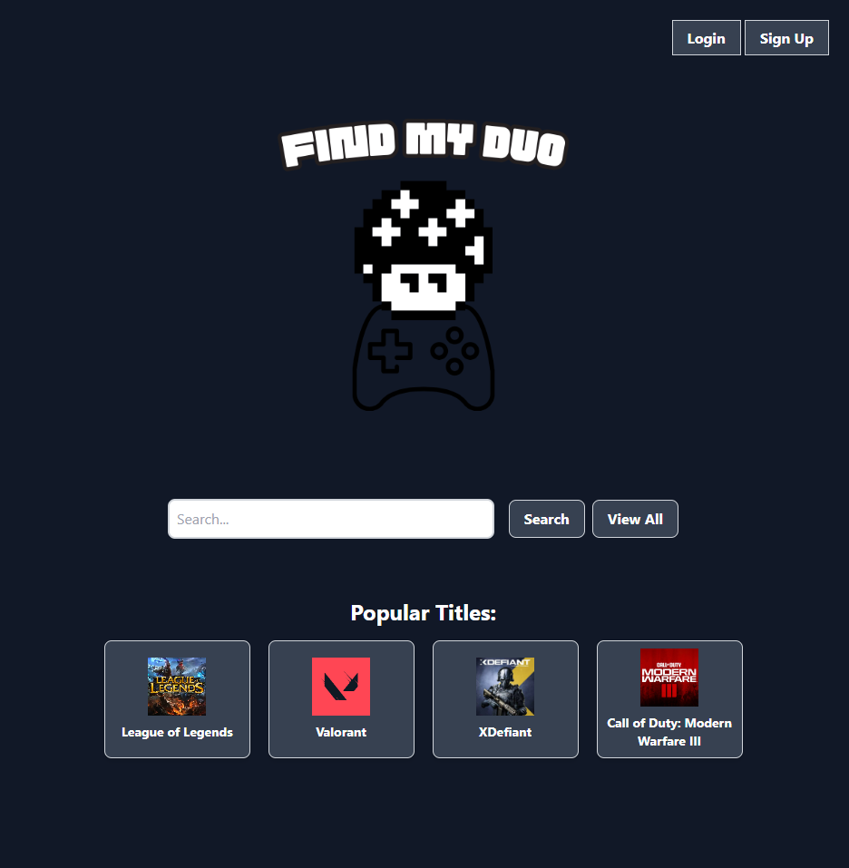
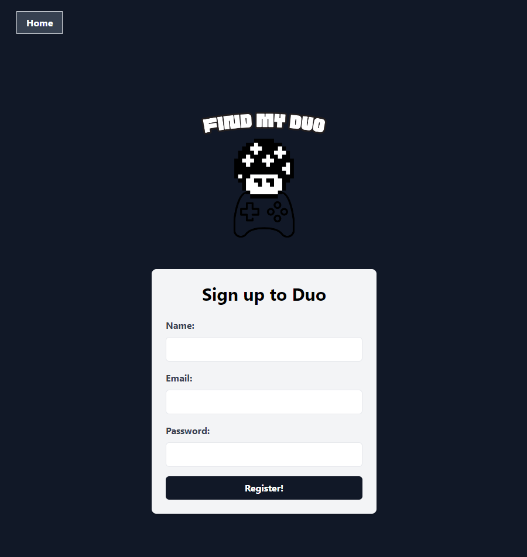
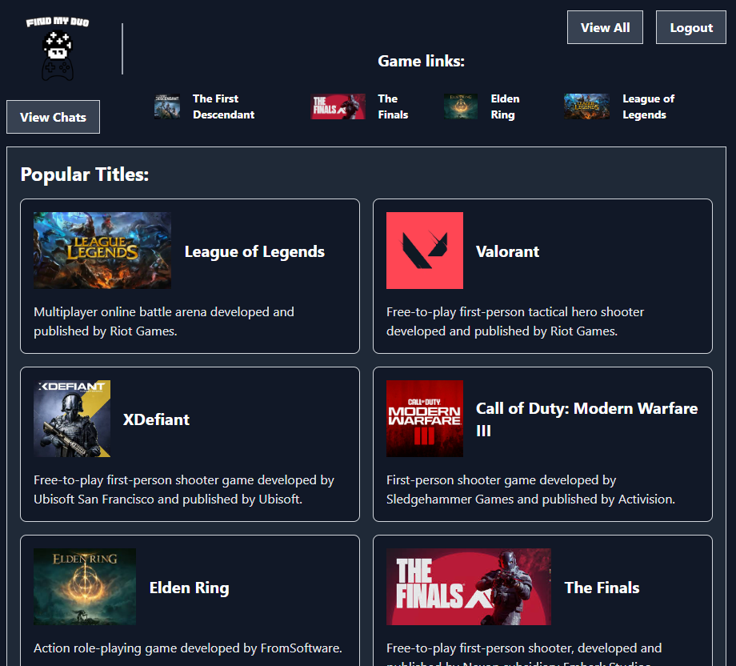

# Find My Duo

## Description

Find My Duo is a web application designed to help gamers find and connect with other players for their favorite games. The application allows users to view a list of games, search for games, and participate in chatrooms dedicated to specific games.

## Table of Contents

- [File Structure](#file-structure)
- [License](#license)
- [Features](#features)
- [Mock-Up](#mock-up)
- [Learning Outcomes](#learning-outcomes)
- [Usage](#usage)
- [Credits](#credits)

## File Structure

```md
Find My Duo/
├── config/
│ └── connection.js
├── controllers/
│ ├── api/
│ │ ├── chatboard-routes.js
│ │ └── game-routes.js
│ ├── home-routes.js
│ └── index.js
├── db/
│ └── schema.sql
├── models/
│ ├── Chatroom.js
│ ├── Game.js
│ └── index.js
├── public/
│ ├── assets/
│ ├── css/
│ ├── js/
├── seeds/
│ ├── -Data.json
│ └── seed.js
├── utils/
│ ├── auth.js
| └── helpers.js
├── views/
│ ├── layouts/
│ │ └── -handlebars
│ ├── partials/
│ │ └── -handlebars
│ ├── -handlebars
└── server.js
```

### License

MIT License

[](https://opensource.org/licenses/MIT)

## Features

- Search for games by title
- View a list of all games
- Join chatrooms for specific games
- Participate in chatrooms in real-time

## Mock-Up

### Deployed Application

[Render Deployment](https://project2-find-my-duo.onrender.com/)

### Home Page



### Sign-Up Page



### Game List Page



## Usage

[GitHub Repo](https://github.com/DeadSeaTupperware/Project2-Find-My-Duo)

Clone the repository

```bash
git clone
```

Install dependencies

```bash
npm install
```

Create a `.env` file in the root directory and add the following code

```bash
DB_NAME='find my duo_db'
DB_USER='root'
DB_PW='your password'
```

Create the database

```bash
psql -U postgres
\i schema.db
```

Seed the database

```bash
npm run seed
```

Start the server

```bash
npm start
```

Navigate to `localhost:3001` in your browser

## Credits

- Dean Bloomingdale [GitHub](https://github.com/DeadSeaTupperware)
- Jacques Flores [GitHub](https://github.com/Jakostein97)
- Jongho Bae [GitHub](https://github.com/jonghoBae0218)
- Jose Falcon [GitHub](https://github.com/josefalconGH)
